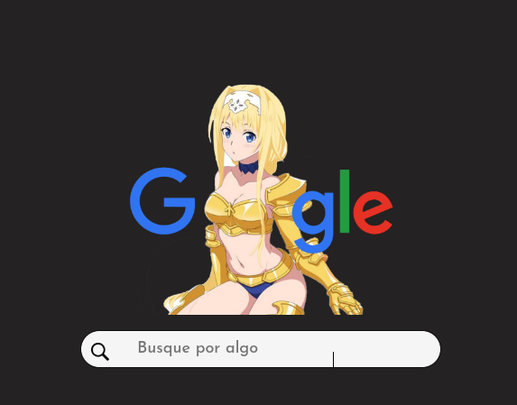
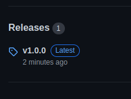
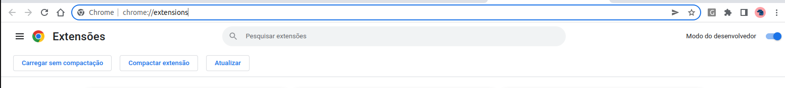
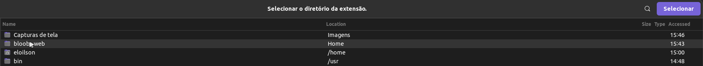
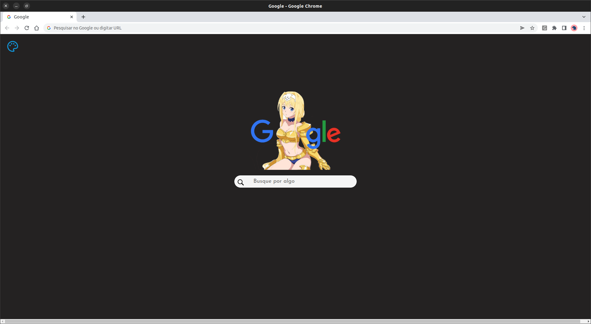

 ## Bloobs Web

 

Personalize seu chrome com  essa extensão maravilhosa!

## Como instalar?

Infelizmente essa extensão não esta disponivel no chrome web store, mas irei ensinar como baixar e instalar.

Vá até a lateral dessa página(no computador, no celular role até o fim desta página) e procure por releases

Clique em v1.0.0, e baixe  o arquivo em .zip

Acesse esse endereço, e ative a opção "modo de desenvolvedor"

Depois descompacte a pasta, vá no endereço do Google que tem na foto acima e aperte em Carregar sem compactação, e selecione a pasta, e pronto, agora é so criar uma nova aba, e essa sera sua tela padrão!

Obrigado a todos que leram até aqui, <3, deixa uma estrela no repósitorio

